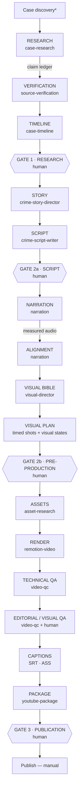

# Architecture

A local-first, free-first pipeline that turns a real criminal case into a
sourced, fact-checked, 5–10 minute documentary rendered with Remotion. Every
stage writes a human-readable artifact; every artifact is validated against
typed contracts; every stage is resumable; and four human gates stand between
research and publication.

## 1. Pipeline



`*` planned. The orchestrator skill `crime-documentary` walks this graph;
the graph itself is code: `src/pipeline/stages.ts` (`STAGE_GRAPH`), with each
stage's skill, required artifacts, required gates, outputs, and the inputs
whose change makes it stale.

### Narration before visual planning

Phase 0 timed shots from word-count estimates. Now:

```
Script → (Gate 2a) → Narration → measured audio → Alignment → Visual plan → timed shots/states
```

Estimates remain for drafting (`ESTIMATED` alignment), but validation refuses
REVIEW/FINAL manifests that are not timed to measured narration
(`MANIFEST_TIMING_NOT_MEASURED`), and the resume planner refuses to run
VISUAL_PLAN on an estimated alignment. On the synthetic fixture the estimate
was 109.1 s and the measured narration 101.4 s — a 7% error that would have
drifted every shot.

## 2. Layers and dependency rule

```
src/domain        contracts (zod + types). Depends on nothing.
src/research      source authority, verification policy, legal language
src/storytelling  duration estimate (drafting), script style lint
src/validation    parse + cross-reference/policy checks → ValidationIssue[]
src/pipeline      stage graph, fingerprints, run state, resume, gates, cost gate
src/production    timing (from alignment), manifest, captions (SRT/ASS), chapters/credits, WAV
src/qa            technical / visual / editorial QA
src/providers     provider interfaces + cost policy (narration, alignment)
src/remotion      primitives, adapter, compositions — the only React/Remotion code
scripts/          Node CLIs — the only filesystem / process access
```

`src/` is isomorphic (Node + Remotion bundle). Remotion never imports
validation decisions it would have to make itself; it receives resolved data.

## 3. Case workspace

```
data/cases/<case-id>/
  case.json  sources.json  claims.json  entities.json  timeline.json
  research.json  research.md
  story-plan.json  script.json
  narration/narration.json   narration/alignment.json
  visual-bible.json  visual-plan.json  assets.json  manifest.json
  runs/<run-id>.json
  output/ qa-report.json  youtube-package.json  captions.srt  captions.ass
          chapters.txt  credits.txt  master.mp4*  master-captioned.mp4*
```

`*` media is git-ignored, as are narration WAVs (stored under
`assets/audio/<case-id>/` — Remotion's public dir — so the renderer can play
them). JSON/Markdown is the review surface; no database.

## 4. Contracts

| Area         | Contracts                                                                                     | File                         |
| ------------ | --------------------------------------------------------------------------------------------- | ---------------------------- |
| Case         | `CaseProject`, `CaseCandidate`                                                                | case-project.ts, research.ts |
| Claim ledger | `CaseSource`, `SourceReference`, `CaseClaim`, `ClaimEvidence`                                 | sources.ts, claims.ts        |
| Entities     | `Person` (legal-status history), `Organization`, `Location`                                   | entities.ts                  |
| Timeline     | `CaseEvent`, `CaseTimeline`, `DateSpec`                                                       | timeline.ts                  |
| Story        | `StoryAngle`, `StoryPlan`, `StorySequence`, `Reveal`                                          | story.ts                     |
| Script       | `ScriptDocument`, `NarrationUnit`                                                             | script.ts                    |
| Narration    | `NarrationArtifact`, `NarrationUnitAudio`, `NarrationSegment`, `NarrationAlignment`           | narration.ts                 |
| Visual       | `CaseVisualBible`; `VisualPlan`, `Shot`, `SceneBeat` (visual states)                          | visual-bible.ts, visual.ts   |
| Assets       | `AssetRequirement`, `AssetRecord` (provenance + production status)                            | assets.ts                    |
| Render       | `ProductionManifest` (timed shots, resolved states, narration, bible rev, input fingerprints) | manifest.ts                  |
| Run state    | `RunManifest`, `RunStage`, `RunItem`, `RunArtifact`, `ApprovalGate`, `CostApproval`           | run.ts                       |
| QA           | `QaReport`, `QaCheck`                                                                         | qa.ts                        |
| Publishing   | `YouTubePackage`                                                                              | youtube.ts                   |

Schema version 1 throughout. Additions this sprint were additive with
defaults (older files still parse), except `CaptionTrack`, which was folded
into `NarrationAlignment` (no persisted instances existed).

## 5. Run state, resume, and selective retry

`runs/<run-id>.json` (`RunManifest`) records, per stage: status, attempts,
`maxAttempts` (3), last error, timestamps, and the **fingerprint of the
stage's inputs** when it completed. Also: artifacts with validity, failure
history, gates, cost approvals, and cost totals.

**Stage statuses:** PENDING, READY, RUNNING, COMPLETE, FAILED, BLOCKED,
SKIPPED, NEEDS_REVIEW. Transitions are enforced (`transitionStage`); e.g.
COMPLETE requires an inputs fingerprint, a gate stage completes only when its
gate is APPROVED and fresh, and FAILED → READY is refused at the retry limit.

**Resume** (`planResume`, `npm run pipeline -- status <case>`) is read-only
and says, per stage:

| Action         | Meaning                                                             |
| -------------- | ------------------------------------------------------------------- |
| KEEP           | Complete and inputs unchanged — never regenerate                    |
| RERUN          | Complete but inputs changed (stale); all downstream stages follow   |
| RETRY          | Failed with attempts left                                           |
| RUN            | Prerequisites met                                                   |
| WAIT_FOR_HUMAN | Gate pending or stale, or output needs review                       |
| BLOCKED        | Missing/invalid prerequisites, gate not approved, retries exhausted |

**Item-level retry** (`planItems`) applies to narration takes, assets, and
any per-item work: COMPLETE → keep, FAILED with attempts left → retry,
PENDING/RUNNING → continue, FAILED at the limit → exhausted (human).
Verified on the fixture: a simulated failure of `nu-003` was retried alone;
the other 13 takes kept their original files; a third run was a no-op; editing
one unit's text re-voiced only that unit.

**Artifact validity** (`assessArtifacts`): VALID / STALE / FAILED / MISSING,
from content fingerprints (`src/pipeline/fingerprint.ts`: canonical JSON +
cyrb53 — change detection, not security). The manifest stores the
fingerprints of script, visual plan, alignment, and bible it was built from
(`MANIFEST_STALE`); narration stores the script fingerprint and per-unit text
fingerprints (`NARRATION_STALE`, `NARRATION_UNIT_STALE`).

## 6. Approval gates

| Gate | Type             | Before                | Reviews                                                                                                                            |
| ---- | ---------------- | --------------------- | ---------------------------------------------------------------------------------------------------------------------------------- |
| 1    | `RESEARCH`       | Story is finalized    | Claims supported, allegations attributed, legal outcomes correct, contradictions documented, timeline gaps understood, sensitivity |
| 2a   | `SCRIPT`         | Narration is produced | Script accurate, framing fair, nothing invented, ready to voice                                                                    |
| 2b   | `PRE_PRODUCTION` | Assets/render         | Narration approved, timing measured and correct, visual identity, shot plan, labels, rights, cost                                  |
| 3    | `PUBLICATION`    | Publishing            | Technical/editorial/visual QA, captions, credits, metadata accuracy, final approval                                                |

An `ApprovalGate` stores a checklist, blocking issues, and a
**subject fingerprint** of exactly what was reviewed. `resolveGate` refuses
approval unless the resolver is `human:<name>`, every checklist item is
answered YES/NA, there are no blocking issues, and the content is unchanged
since the request. After approval, any change to the reviewed artifacts makes
the gate **STALE** and downstream stages wait again.

Human commands (agents may request, never resolve):

```bash
npm run gate -- request <case> RESEARCH
npm run gate -- show    <case> gate-research-1
npm run gate -- approve <case> gate-research-1 --by="human:Your Name" --all-yes --notes="…"
npm run gate -- changes <case> gate-research-1 --by="human:Your Name" --issue="…"
```

Narration produced before the SCRIPT gate (`npm run narrate -- <case> --draft`)
is marked `producedFromApprovedScript: false` and can never time a REVIEW or
FINAL manifest (`MANIFEST_DRAFT_NARRATION`).

## 7. Cost gate

Free-first: the expected cost of a run is $0. Every provider has a
`costTier`. PAID operations require **both** `ALLOW_PAID_PROVIDERS=true` and
a human-approved `CostApproval` in the run that lists the exact jobs and an
estimate ≥ the operation's (`assertPaidOperationApproved`). Assets carry
`estimatedCostUsd` (default 0; >0 raises `PAID_ASSET`). No paid provider is
implemented.

## 8. Remotion's responsibility

**Remotion owns:** composing and rendering the manifest — timed shots, visual
states (as frames), narration audio, the visual bible (as CSS variables),
labels, citations, and captions for the optional derivative.

**Remotion does not own:** what the story is, whether a claim is true, which
evidence is trustworthy, narrative structure, timing decisions, rights.
Those are decided upstream and validated before a render is allowed.

`CaseVideo` props: `showCaptions` (false for the master), `withNarration`.
The ShotType → component mapping lives only in
`src/remotion/adapters/scene-spec.ts`.

## 9. Validation

`validateRawWorkspace` = schema parse + ~140 policy/cross-reference issue
codes (ERROR / WARNING / INFO), across research, timeline, story, script,
narration, alignment, visual bible, visual plan, assets, manifest, QA report,
and YouTube package. `npm run validate:case -- <case> [--all]`.

## 10. Commands

| Command                                                 | Purpose                                      |
| ------------------------------------------------------- | -------------------------------------------- |
| `npm run new:case -- <slug> "<Name>"`                   | Scaffold a workspace                         |
| `npm run validate:case -- <case>`                       | Validate everything                          |
| `npm run pipeline -- init/status/mark <case>`           | Run state, resume plan, stage transitions    |
| `npm run gate -- request/show/approve/reject/changes …` | Human gates                                  |
| `npm run narrate -- <case> [--draft]`                   | Local narration → measured audio → alignment |
| `npm run build:manifest -- <case>`                      | Timed manifest from alignment                |
| `npm run deliverables -- <case>`                        | captions.srt/.ass, chapters.txt, credits.txt |
| `npm run qa -- <case>`                                  | QA report (ffprobe + silencedetect + checks) |
| `npm run render:fixture:master` / `:captioned`          | Fixture master / captioned derivative        |
| `npm run health`                                        | All quality gates, logged                    |
